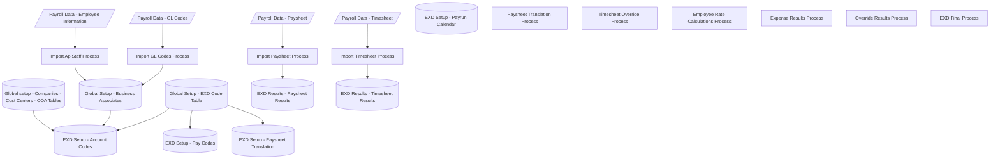

# DataFlow

## Getting Super Powers

Becoming a super hero is a fairly straight forward process:

```
$ give me super-powers
```


 Super-powers are granted randomly so please submit an issue if you're not happy with yours.


Once you're strong enough, save the world:


```bash
# Ain't no code for that yet, sorry
echo 'You got to trust me on this, I saved the world'
```





[![](https://mermaid.ink/img/eyJjb2RlIjoiZ3JhcGggVERcbkFbL1BheXJvbGwgRGF0YSAtIEVtcGxveWVlIEluZm9ybWF0aW9uL11cbkJbL1BheXJvbGwgRGF0YSAtIEdMIENvZGVzL11cbkNbL1BheXJvbGwgRGF0YSAtIFBheXNoZWV0L11cbkRbL1BheXJvbGwgRGF0YSAtIFRpbWVzaGVldC9dXG5GWyhHbG9iYWwgc2V0dXAgLSBDb21wYW5pZXMgLSBDb3N0IENlbnRlcnMgLSBDT0EgVGFibGVzKV1cbkVbKEdsb2JhbCBTZXR1cCAtIEJ1c2luZXNzIEFzc29jaWF0ZXMpXVxuR1soRVhEIFNldHVwIC0gQWNjb3VudCBDb2RlcyldXG5IWyhHbG9iYWwgU2V0dXAgLSBFWEQgQ29kZSBUYWJsZSldXG5JWyhFWEQgU2V0dXAgLSBQYXkgQ29kZXMpXVxuSlsoRVhEIFNldHVwIC0gUGF5c2hlZXQgVHJhbnNsYXRpb24pXVxuS1soRVhEIFNldHVwIC0gUGF5cnVuIENhbGVuZGFyKV1cbkxbKEVYRCBSZXN1bHRzIC0gUGF5c2hlZXQgUmVzdWx0cyldXG5NW1BheXNoZWV0IFRyYW5zbGF0aW9uIFByb2Nlc3NdXG5OW1RpbWVzaGVldCBPdmVycmlkZSBQcm9jZXNzXVxuT1tFbXBsb3llZSBSYXRlIENhbGN1bGF0aW9ucyBQcm9jZXNzXVxuUFtFeHBlbnNlIFJlc3VsdHMgUHJvY2Vzc11cblFbT3ZlcnJpZGUgUmVzdWx0cyBQcm9jZXNzXVxuUltFWEQgRmluYWwgUHJvY2Vzc11cblNbSW1wb3J0IEdMIENvZGVzIFByb2Nlc3NdXG5UW0ltcG9ydCBBcCBTdGFmZiBQcm9jZXNzXVxuVVtJbXBvcnQgVGltZXNoZWV0IFByb2Nlc3NdXG5WW0ltcG9ydCBQYXlzaGVldCBQcm9jZXNzXVxuV1soRVhEIFJlc3VsdHMgLSBUaW1lc2hlZXQgUmVzdWx0cyldXG5cbkEgLS0-IFRcblQgLS0-IEVcbkIgLS0-IFNcblMgLS0-IEVcbkYgLS0-IEdcbkUgLS0-IEdcbkggLS0-IEdcbkggLS0-IElcbkggLS0-IEpcblxuQyAtLT4gVlxuViAtLT4gTFxuXG5EIC0tPiBVXG5VIC0tPiBXXG4iLCJtZXJtYWlkIjp7InRoZW1lIjoiZGVmYXVsdCJ9fQ)](https://mermaid-js.github.io/mermaid-live-editor/#/edit/eyJjb2RlIjoiZ3JhcGggVERcbkFbL1BheXJvbGwgRGF0YSAtIEVtcGxveWVlIEluZm9ybWF0aW9uL11cbkJbL1BheXJvbGwgRGF0YSAtIEdMIENvZGVzL11cbkNbL1BheXJvbGwgRGF0YSAtIFBheXNoZWV0L11cbkRbL1BheXJvbGwgRGF0YSAtIFRpbWVzaGVldC9dXG5GWyhHbG9iYWwgc2V0dXAgLSBDb21wYW5pZXMgLSBDb3N0IENlbnRlcnMgLSBDT0EgVGFibGVzKV1cbkVbKEdsb2JhbCBTZXR1cCAtIEJ1c2luZXNzIEFzc29jaWF0ZXMpXVxuR1soRVhEIFNldHVwIC0gQWNjb3VudCBDb2RlcyldXG5IWyhHbG9iYWwgU2V0dXAgLSBFWEQgQ29kZSBUYWJsZSldXG5JWyhFWEQgU2V0dXAgLSBQYXkgQ29kZXMpXVxuSlsoRVhEIFNldHVwIC0gUGF5c2hlZXQgVHJhbnNsYXRpb24pXVxuS1soRVhEIFNldHVwIC0gUGF5cnVuIENhbGVuZGFyKV1cbkxbKEVYRCBSZXN1bHRzIC0gUGF5c2hlZXQgUmVzdWx0cyldXG5NW1BheXNoZWV0IFRyYW5zbGF0aW9uIFByb2Nlc3NdXG5OW1RpbWVzaGVldCBPdmVycmlkZSBQcm9jZXNzXVxuT1tFbXBsb3llZSBSYXRlIENhbGN1bGF0aW9ucyBQcm9jZXNzXVxuUFtFeHBlbnNlIFJlc3VsdHMgUHJvY2Vzc11cblFbT3ZlcnJpZGUgUmVzdWx0cyBQcm9jZXNzXVxuUltFWEQgRmluYWwgUHJvY2Vzc11cblNbSW1wb3J0IEdMIENvZGVzIFByb2Nlc3NdXG5UW0ltcG9ydCBBcCBTdGFmZiBQcm9jZXNzXVxuVVtJbXBvcnQgVGltZXNoZWV0IFByb2Nlc3NdXG5WW0ltcG9ydCBQYXlzaGVldCBQcm9jZXNzXVxuV1soRVhEIFJlc3VsdHMgLSBUaW1lc2hlZXQgUmVzdWx0cyldXG5cbkEgLS0-IFRcblQgLS0-IEVcbkIgLS0-IFNcblMgLS0-IEVcbkYgLS0-IEdcbkUgLS0-IEdcbkggLS0-IEdcbkggLS0-IElcbkggLS0-IEpcblxuQyAtLT4gVlxuViAtLT4gTFxuXG5EIC0tPiBVXG5VIC0tPiBXXG4iLCJtZXJtYWlkIjp7InRoZW1lIjoiZGVmYXVsdCJ9fQ)
